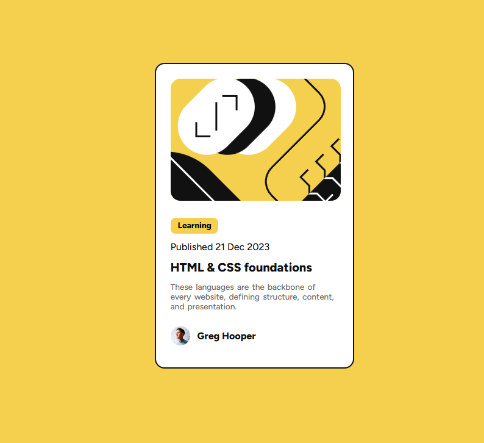

<h1 align="center"> Frontend Mentor - Solução Cartão de Pré-visualização de Blog</h1>

Essa é uma solução para o [Desafio Cartão Pré-visualização de Blog no Frontend Mentor](https://www.frontendmentor.io/challenges/blog-preview-card-ckPaj01IcS). Os desafios do Frontend Mentor ajudam você a aprimorar suas habilidades de programação por meio da criação de projetos realistas.

    

## 💻 Projeto

Este projeto é um cartão de pré-visualização de um blog sobre HTML e CSS.

## 🚀 Tecnologias

Esse projeto foi desenvolvido com as seguintes tecnologias:

- HTML
- CSS
- Git e GitHub

### O Que Aprendi

- Organização e Estruturação de HTML semântico
- Novas propriedades CSS como `word-spacing`
- Alinhamento de vários elementos à partir do elemento pai com `display: flex`
- Estilização mobile-first

### Links
- Acesse a URL da solução [clicando aqui](https://github.com/Antonio-Rafael-Silva/blog-preview-card)
- Acesse o site do projeto [clicando aqui](https://antonio-rafael-silva.github.io/blog-preview-card/)

## Screenshot do resultado

### Versão Final

 
    

## Autor 

- Website - [Antônio Rafael](https://antonio-rafael-silva.github.io/blog-preview-card/)
- Frontend Mentor - [@Antonio-Rafael-Silva](https://www.frontendmentor.io/profile/Antonio-Rafael-Silva)
- Linkedin - [Antônio Rafael](https://www.linkedin.com/in/ant%C3%B4nio-rafael-01131b372/)